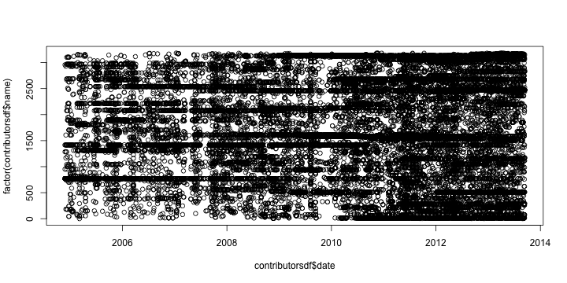
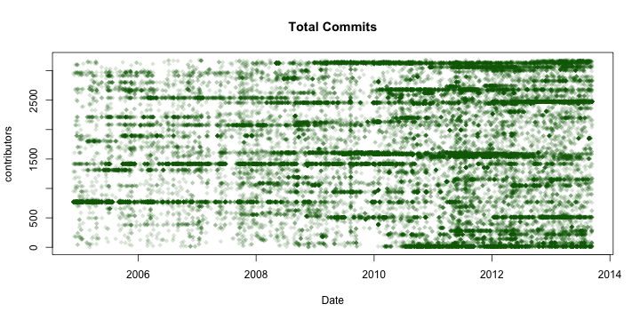
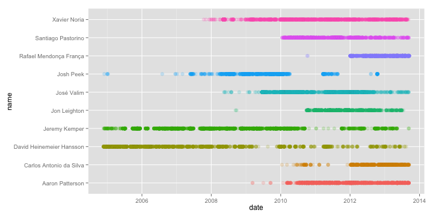
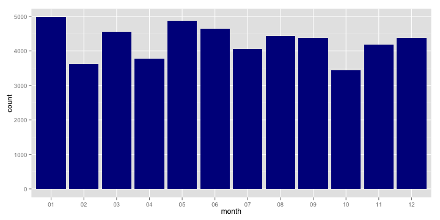
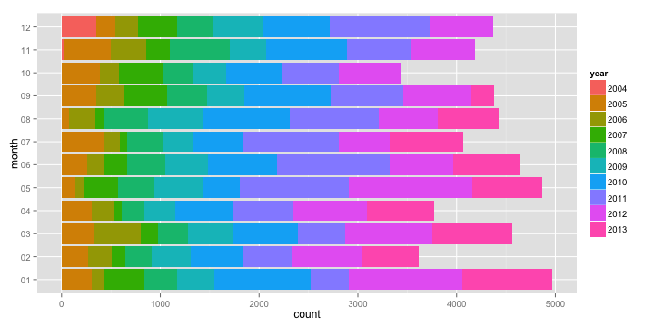
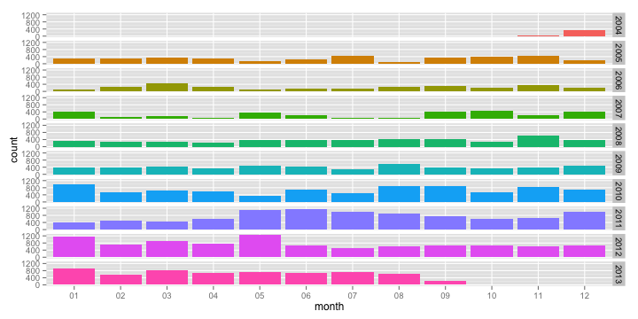
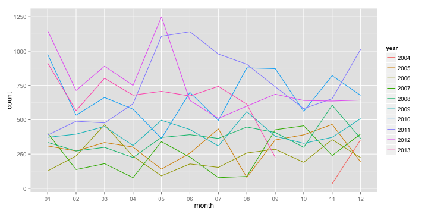
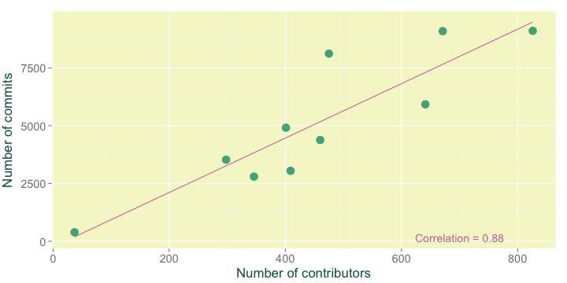
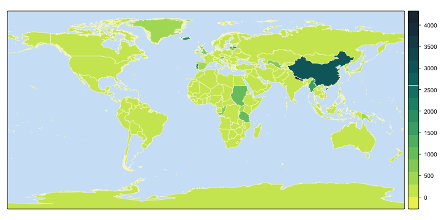
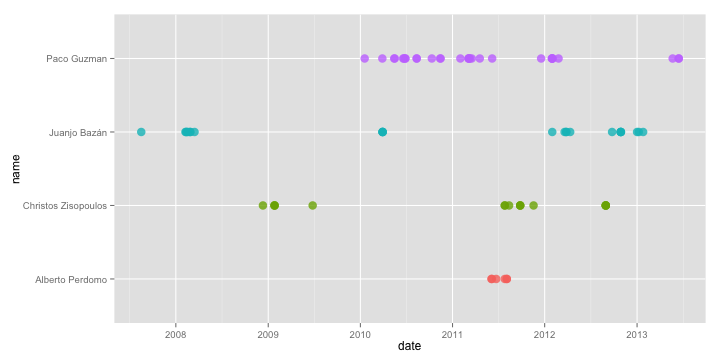

Introduction to R
========================================================

#Fuertehack 2013
-------------------
#### The code shown in the #Fuertehack talk to do a brief demo of what can be done in R by @\_bmartinez\_


### 1. DATA IMPORT
   
Set the working directory (where the files are being to be loaded from and where they are going to be saved)

```r
getwd()
```

```
## [1] "/Users/martinez/Dropbox/IntroduccionR"
```

```r
setwd("~/Dropbox/IntroduccionR")
```

    
    
Download the home page http://contributors.rubyonrails.org/ and save it as *.txt

```r
url <- "http://contributors.rubyonrails.org/"
download.file(url, destfile = "Data/contributors00.txt")
```

         
       
Load the contributors00.txt file into R

```r
contributors <- readLines("Data/contributors00.txt")
contributors[60:70]  # Have a look at some lines
```

```
##  [1] "    </tr>"                                                                                                             
##  [2] "    <tr class=\"even\">"                                                                                               
##  [3] "  <td class=\"rank-data\">#1</td>"                                                                                     
##  [4] "  <td class=\"highlight\"><a href=\"/contributors/jeremy-kemper/commits\">Jeremy Kemper</a></td>"                      
##  [5] "  <td class=\"no-commits\">"                                                                                           
##  [6] "    <a href=\"/contributors/jeremy-kemper/commits\">4020</a>"                                                          
##  [7] "  </td>"                                                                                                               
##  [8] "</tr>"                                                                                                                 
##  [9] "<tr class=\"odd\">"                                                                                                    
## [10] "  <td class=\"rank-data\">#2</td>"                                                                                     
## [11] "  <td class=\"highlight\"><a href=\"/contributors/david-heinemeier-hansson/commits\">David Heinemeier Hansson</a></td>"
```

   
       
Once we have the homepage saved and loaded into R, we need to extract a vector with the URLs for every contributor page.    
We will find the URLs in the homepage code by using regular expressions.

```r
contributorsLines <- grep("highlight", contributors, fixed = TRUE, value = TRUE)  # Extract the lines where the contributors' names are, formatted to create the URL to their pages.

r <- gregexpr("/contributors/(.*)/commits", contributorsLines)  # Get two indices: where the match starts and the match's length.
contributorsURL <- regmatches(contributorsLines, r)  # Get the registered matches.
contributorsURL <- paste("http://contributors.rubyonrails.org", contributorsURL, 
    sep = "")  # Paste the registered matches to the main URL.

head(contributorsURL)  # We have now the URLs vector, containing every URL for each contributor page.
```

```
## [1] "http://contributors.rubyonrails.org/contributors/jeremy-kemper/commits"           
## [2] "http://contributors.rubyonrails.org/contributors/david-heinemeier-hansson/commits"
## [3] "http://contributors.rubyonrails.org/contributors/aaron-patterson/commits"         
## [4] "http://contributors.rubyonrails.org/contributors/jose-valim/commits"              
## [5] "http://contributors.rubyonrails.org/contributors/xavier-noria/commits"            
## [6] "http://contributors.rubyonrails.org/contributors/rafael-mendonca-franca/commits"
```

      
          
Now, download every contributor page as *.txt, load into R and get the data we want (contributor name, rank, date, message).    
This may take a looong time, so you'd better download the resultant *.csv.

```r
urlCsv <- "https://raw.github.com/beamartinez/fuertehack/master/Data/contributorsdf.csv"
download.file(urlCsv, destfile = "contributorsdf.csv", method = "curl")  # method must be set to 'curl' as it is a secure URL (https)
contributorsdf <- read.csv("contributorsdf.csv", header = TRUE, sep = ",", stringsAsFactors = FALSE)
```

   
       
Uncomment the code below to run the whole process (just remember it takes a time; it depends on your internet connection, but it took me more than half an hour)

```r
	# contributorsdf <- data.frame()  # Create an empty data.frame where store the data as it is being extracting from the contributors' pages.

	# for (i in (1:length(contributorsURL))){  # For every contributors' page
	
		## Download it		
		# url2 <- contributorsURL[i]
		# download.file(url2, destfile = paste("Data/contributor",i,".txt", sep = ""))
		# contributor <- readLines(paste("Data/contributor",i,".txt", sep = ""))  

		## Generate a vector with the commits dates.
		# date <- grep("commit-date", contributor, fixed = TRUE, value=TRUE)
		# r <- gregexpr("[0-9]{4}-[0-9]{2}-[0-9]{2}", date)
		# date <- unlist(regmatches(date,r))

		## Another one with the commit messages.
		# message <- grep("commit-message", contributor, fixed = TRUE, value = TRUE)
		# r <- regexec(">(.*)<", message)
		# message <- regmatches(message, r)
		# message <- sapply(message, function(x) x[2])

		## Extract the contributors' names and ranks.
		# r <- regexec("Rails Contributors - #(.*?) (.*) -", contributor)
		# m <- unlist(regmatches(contributor, r))
		# rank <- m[2]  
		# name <- m[3]

		## Join the four vectors (date, message, name and rank) in a data.frame
		# tableContributor <- as.data.frame(cbind(date, message))
		# tableContributor$name <- name
		# tableContributor$rank <- rank

		## Store this data in the empty data.frame created before the for loop.
		# contributorsdf <- rbind(tableContributor, contributorsdf)
	#}
```

            
        
The data.frame with the data we wanted is ready.

```r
head(contributorsdf)
```

```
##         date
## 1 2007-01-12
## 2 2013-03-26
## 3 2012-12-24
## 4 2008-03-24
## 5 2006-07-10
## 6 2013-04-02
##                                                          message
## 1              Fix scope typo in add_lock! Closes #6482. [zubek]
## 2                         Fixed timezone mapping of Ulaanbaatar.
## 3                                              minor grammar fix
## 4    Fixed NumberHelper#number_with_precision to properly rou...
## 5 create_table rdoc: suggest :id =&gt; false for habtm join t...
## 6             Escape multibyte line terminators in JSON encoding
##          name rank
## 1       zubek 1814
## 2     Zolzaya 1814
## 3 Zoltan Kiss 1814
## 4 zhangyuanyi 1814
## 5    Zed Shaw 1814
## 6     zackham 1814
```

    
        
Now you can save it (new data have been generated in R !)

```r
write.csv(contributorsdf, file = "Data/contributorsdf.csv", row.names = FALSE)
```


    
And load the file again to use it as input data.

```r
contributorsdf <- read.csv("Data/contributorsdf.csv", header = TRUE, sep = ",", 
    stringsAsFactors = FALSE)
```


    
    
### 2a. DATA TREATMENT
     
         
Have a look at the data and get information about the object.

```r
str(contributorsdf)
```

```
## 'data.frame':	51283 obs. of  4 variables:
##  $ date   : chr  "2007-01-12" "2013-03-26" "2012-12-24" "2008-03-24" ...
##  $ message: chr  "Fix scope typo in add_lock! Closes #6482. [zubek]" "Fixed timezone mapping of Ulaanbaatar." "minor grammar fix" "Fixed NumberHelper#number_with_precision to properly rou..." ...
##  $ name   : chr  "zubek" "Zolzaya" "Zoltan Kiss" "zhangyuanyi" ...
##  $ rank   : int  1814 1814 1814 1814 1814 1814 1814 1814 1814 1814 ...
```

```r
summary(contributorsdf)
```

```
##      date             message              name                rank     
##  Length:51283       Length:51283       Length:51283       Min.   :   1  
##  Class :character   Class :character   Class :character   1st Qu.:   4  
##  Mode  :character   Mode  :character   Mode  :character   Median :  12  
##                                                           Mean   : 146  
##                                                           3rd Qu.:  61  
##                                                           Max.   :1814
```

    
     
Change an object class

```r
contributorsdf$date <- as.Date(contributorsdf$date, "%Y-%m-%d")
summary(contributorsdf)
```

```
##       date              message              name                rank     
##  Min.   :1970-01-01   Length:51283       Length:51283       Min.   :   1  
##  1st Qu.:2008-09-23   Class :character   Class :character   1st Qu.:   4  
##  Median :2010-10-30   Mode  :character   Mode  :character   Median :  12  
##  Mean   :2010-04-26                                         Mean   : 146  
##  3rd Qu.:2012-03-13                                         3rd Qu.:  61  
##  Max.   :2013-09-14                                         Max.   :1814
```

    
      
Remove one register

```r
contributorsdf <- contributorsdf[which(contributorsdf$date != "1970-01-01"), 
    ]  # The date was wrong, so we remove the whole observation.
nrow(contributorsdf)
```

```
## [1] 51282
```

   
       
Add some information from other data.frame.     
	E.g.: Assign a country to each contributor (not the real one this time).

```r
# Download the countries list (with their codes) and load it into R.

urlCountries <- "https://dl.dropboxusercontent.com/s/c8nlins4davcnz8/ISOcountries.csv?token_hash=AAGb1r0-10fvR-q_eLY6-f5XtshKkYR0jXXFDHQ1mdOY3A&dl=1"
download.file(urlCountries, destfile = "Data/ISOcountries.csv", method = "curl")
ISOcountries <- read.csv("Data/ISOcountries.csv")
head(ISOcountries)
```

```
##   codes      countries
## 1    AF    AFGHANISTAN
## 2    AX  ÅLAND ISLANDS
## 3    AL        ALBANIA
## 4    DZ        ALGERIA
## 5    AS AMERICAN SAMOA
## 6    AD        ANDORRA
```

```r
# Generate a vector which will have the same length that the number of
# contributors
codes <- sample(ISOcountries$codes, length(unique(contributorsdf$name)), replace = TRUE)

# Get a vector containing the contributors names without repetitions
uniqueContributors <- unique(as.character(contributorsdf$name))

# Join both vectors into a data.frame and merge to ISOcountries to add the
# countries' names.
countries <- data.frame(uniqueContributors, codes)
countries <- merge(countries, ISOcountries, by = "codes")
head(countries)
```

```
##   codes uniqueContributors countries
## 1    AD   Paul Hieromnimon   ANDORRA
## 2    AD         Drew Ulmer   ANDORRA
## 3    AD    Dave Desrochers   ANDORRA
## 4    AD     Étienne Barrié   ANDORRA
## 5    AD        Ilya Zayats   ANDORRA
## 6    AD    Pirogov Evgenij   ANDORRA
```

```r
# Merge the 'countries' data.frame with the contributorsdf
contributorsdf <- merge(contributorsdf, countries, by.x = "name", by.y = "uniqueContributors")
str(contributorsdf)  # Two new variables have been added to the data.frame, 'codes' and 'countries'
```

```
## 'data.frame':	51282 obs. of  6 variables:
##  $ name     : chr  "_why the lucky stiff" "11834" "1334" "1334" ...
##  $ date     : Date, format: "2005-03-06" "2013-08-30" ...
##  $ message  : chr  "Added Object#blank? -- see http://redhanded.hobix.com/in..." "FIX reload! within rails console --sandbox causes undefi..." "fix some formatting" "Fix a typo" ...
##  $ rank     : int  1814 1814 1078 1078 1078 1078 1814 549 549 549 ...
##  $ codes    : Factor w/ 248 levels "AD","AE","AF",..: 218 173 117 117 178 178 207 126 126 126 ...
##  $ countries: Factor w/ 249 levels "AFGHANISTAN",..: 219 174 38 38 177 177 208 122 122 122 ...
```

    
       
Split the 'date' variable in other two: 'year' and 'month'

```r
dates <- strsplit(as.character(contributorsdf$date), "-")
contributorsdf$year <- sapply(dates, function(x) x[1])
contributorsdf$month <- sapply(dates, function(x) x[2])
rm(dates)
```

    
    
Subset the top 10 contributors

```r
freqCommits <- data.frame(table(contributorsdf$name))  # Get the frequency table of commits per contributor.
names(freqCommits)  # The given names are not very intuitive.
```

```
## [1] "Var1" "Freq"
```

```r
names(freqCommits) <- c("name", "Freq")  # Change the columns names.
freqCommits <- freqCommits[order(-freqCommits$Freq), ]  # Sort the values in decreasing order.
head(freqCommits)  # Have a look at the firsts rows
```

```
##                          name Freq
## 1417            Jeremy Kemper 4019
## 770  David Heinemeier Hansson 3628
## 15            Aaron Patterson 3474
## 1585               José Valim 2979
## 3129             Xavier Noria 2046
## 2474   Rafael Mendonça França 1948
```

```r
top10 <- as.character(freqCommits$name[1:10])  # Get a vector with the top 10 contributors names (from a factor, that is why 'as.character' should be used).
top10contributors <- contributorsdf[contributorsdf$name %in% top10, ]  # Subset the observations related to the top 10 contributors from the main data.frame.
unique(top10contributors$name)
```

```
##  [1] "Aaron Patterson"          "Carlos Antonio da Silva" 
##  [3] "David Heinemeier Hansson" "Jeremy Kemper"           
##  [5] "Jon Leighton"             "José Valim"              
##  [7] "Josh Peek"                "Rafael Mendonça França"  
##  [9] "Santiago Pastorino"       "Xavier Noria"
```

```r
identical(sort(unique(top10contributors$name)), sort(top10))
```

```
## [1] TRUE
```

```r
rm(freqCommits, top10)  # Remove the unnecessary objects.
```

    
        
          
### 2b. DATA ANALYSIS
    
       
Get frequency tables
    
    
Number of commits per year

```r
table(contributorsdf$year)
```

```
## 
## 2004 2005 2006 2007 2008 2009 2010 2011 2012 2013 
##  388 3527 2795 3048 4380 4911 8117 9089 9105 5922
```

```r
mean(table(contributorsdf$year))  # mean of commits per year for the period 2004-2013
```

```
## [1] 5128
```

    
    
Number of commits per month and year

```r
freqYM <- table(contributorsdf$year, contributorsdf$month)
freqYM
```

```
##       
##          01   02   03   04   05   06   07   08   09   10   11   12
##   2004    0    0    0    0    0    0    0    0    0    0   34  354
##   2005  309  272  334  301  140  256  433   80  353  390  466  193
##   2006  127  236  464  234   91  178  153  258  285  190  355  224
##   2007  402  137  180   78  340  228   78   87  427  456  239  396
##   2008  335  272  299  225  371  391  364  447  407  299  606  364
##   2009  372  395  451  312  496  429  309  559  380  328  372  508
##   2010  976  533  662  577  364  699  495  878  872  562  821  678
##   2011  388  489  477  616 1108 1141  979  904  740  581  653 1013
##   2012 1149  713  890  750 1249  640  510  599  686  640  636  643
##   2013  913  566  802  679  707  673  743  613  226    0    0    0
```

```r
margin.table(freqYM, 1)  # 'year' frequencies (summed over 'month')
```

```
## 
## 2004 2005 2006 2007 2008 2009 2010 2011 2012 2013 
##  388 3527 2795 3048 4380 4911 8117 9089 9105 5922
```

```r
margin.table(freqYM, 2)  # 'month' frequencies (summed over 'year')
```

```
## 
##   01   02   03   04   05   06   07   08   09   10   11   12 
## 4971 3613 4559 3772 4866 4635 4064 4425 4376 3446 4182 4373
```

```r
prop.table(freqYM)  # Cell percentages
```

```
##       
##              01       02       03       04       05       06       07
##   2004 0.000000 0.000000 0.000000 0.000000 0.000000 0.000000 0.000000
##   2005 0.006026 0.005304 0.006513 0.005870 0.002730 0.004992 0.008444
##   2006 0.002477 0.004602 0.009048 0.004563 0.001775 0.003471 0.002984
##   2007 0.007839 0.002672 0.003510 0.001521 0.006630 0.004446 0.001521
##   2008 0.006533 0.005304 0.005831 0.004388 0.007235 0.007625 0.007098
##   2009 0.007254 0.007703 0.008795 0.006084 0.009672 0.008366 0.006026
##   2010 0.019032 0.010394 0.012909 0.011252 0.007098 0.013631 0.009653
##   2011 0.007566 0.009536 0.009302 0.012012 0.021606 0.022250 0.019091
##   2012 0.022406 0.013904 0.017355 0.014625 0.024356 0.012480 0.009945
##   2013 0.017804 0.011037 0.015639 0.013241 0.013787 0.013124 0.014489
##       
##              08       09       10       11       12
##   2004 0.000000 0.000000 0.000000 0.000663 0.006903
##   2005 0.001560 0.006884 0.007605 0.009087 0.003764
##   2006 0.005031 0.005558 0.003705 0.006923 0.004368
##   2007 0.001697 0.008327 0.008892 0.004661 0.007722
##   2008 0.008717 0.007937 0.005831 0.011817 0.007098
##   2009 0.010901 0.007410 0.006396 0.007254 0.009906
##   2010 0.017121 0.017004 0.010959 0.016010 0.013221
##   2011 0.017628 0.014430 0.011330 0.012734 0.019754
##   2012 0.011681 0.013377 0.012480 0.012402 0.012539
##   2013 0.011954 0.004407 0.000000 0.000000 0.000000
```

```r
prop.table(freqYM, 1)  # Row percentages
```

```
##       
##             01      02      03      04      05      06      07      08
##   2004 0.00000 0.00000 0.00000 0.00000 0.00000 0.00000 0.00000 0.00000
##   2005 0.08761 0.07712 0.09470 0.08534 0.03969 0.07258 0.12277 0.02268
##   2006 0.04544 0.08444 0.16601 0.08372 0.03256 0.06369 0.05474 0.09231
##   2007 0.13189 0.04495 0.05906 0.02559 0.11155 0.07480 0.02559 0.02854
##   2008 0.07648 0.06210 0.06826 0.05137 0.08470 0.08927 0.08311 0.10205
##   2009 0.07575 0.08043 0.09183 0.06353 0.10100 0.08735 0.06292 0.11383
##   2010 0.12024 0.06566 0.08156 0.07109 0.04484 0.08612 0.06098 0.10817
##   2011 0.04269 0.05380 0.05248 0.06777 0.12191 0.12554 0.10771 0.09946
##   2012 0.12619 0.07831 0.09775 0.08237 0.13718 0.07029 0.05601 0.06579
##   2013 0.15417 0.09558 0.13543 0.11466 0.11939 0.11364 0.12546 0.10351
##       
##             09      10      11      12
##   2004 0.00000 0.00000 0.08763 0.91237
##   2005 0.10009 0.11058 0.13212 0.05472
##   2006 0.10197 0.06798 0.12701 0.08014
##   2007 0.14009 0.14961 0.07841 0.12992
##   2008 0.09292 0.06826 0.13836 0.08311
##   2009 0.07738 0.06679 0.07575 0.10344
##   2010 0.10743 0.06924 0.10115 0.08353
##   2011 0.08142 0.06392 0.07185 0.11145
##   2012 0.07534 0.07029 0.06985 0.07062
##   2013 0.03816 0.00000 0.00000 0.00000
```

```r
prop.table(freqYM, 2)  # Column percentages
```

```
##       
##             01      02      03      04      05      06      07      08
##   2004 0.00000 0.00000 0.00000 0.00000 0.00000 0.00000 0.00000 0.00000
##   2005 0.06216 0.07528 0.07326 0.07980 0.02877 0.05523 0.10655 0.01808
##   2006 0.02555 0.06532 0.10178 0.06204 0.01870 0.03840 0.03765 0.05831
##   2007 0.08087 0.03792 0.03948 0.02068 0.06987 0.04919 0.01919 0.01966
##   2008 0.06739 0.07528 0.06558 0.05965 0.07624 0.08436 0.08957 0.10102
##   2009 0.07483 0.10933 0.09893 0.08271 0.10193 0.09256 0.07603 0.12633
##   2010 0.19634 0.14752 0.14521 0.15297 0.07480 0.15081 0.12180 0.19842
##   2011 0.07805 0.13534 0.10463 0.16331 0.22770 0.24617 0.24090 0.20429
##   2012 0.23114 0.19734 0.19522 0.19883 0.25668 0.13808 0.12549 0.13537
##   2013 0.18367 0.15666 0.17592 0.18001 0.14529 0.14520 0.18282 0.13853
##       
##             09      10      11      12
##   2004 0.00000 0.00000 0.00813 0.08095
##   2005 0.08067 0.11317 0.11143 0.04413
##   2006 0.06513 0.05514 0.08489 0.05122
##   2007 0.09758 0.13233 0.05715 0.09056
##   2008 0.09301 0.08677 0.14491 0.08324
##   2009 0.08684 0.09518 0.08895 0.11617
##   2010 0.19927 0.16309 0.19632 0.15504
##   2011 0.16910 0.16860 0.15615 0.23165
##   2012 0.15676 0.18572 0.15208 0.14704
##   2013 0.05165 0.00000 0.00000 0.00000
```

```r
colMeans(freqYM)  # Monthly means
```

```
##    01    02    03    04    05    06    07    08    09    10    11    12 
## 497.1 361.3 455.9 377.2 486.6 463.5 406.4 442.5 437.6 344.6 418.2 437.3
```

```r
rowMeans(freqYM)  # Yearly means
```

```
##   2004   2005   2006   2007   2008   2009   2010   2011   2012   2013 
##  32.33 293.92 232.92 254.00 365.00 409.25 676.42 757.42 758.75 493.50
```

     
     
Commits by contributor per year (only for the top ten contributors) 

```r
freqYC <- table(top10contributors$year, top10contributors$name)
colMeans(freqYC)  # Mean of commits per year by contributor
```

```
##          Aaron Patterson  Carlos Antonio da Silva David Heinemeier Hansson 
##                    347.4                    134.9                    362.8 
##            Jeremy Kemper             Jon Leighton               José Valim 
##                    401.9                    118.4                    297.9 
##                Josh Peek   Rafael Mendonça França       Santiago Pastorino 
##                    123.0                    194.8                    170.7 
##             Xavier Noria 
##                    204.6
```

    
    
Cross tables

```r
xtabs(~name + year, data = top10contributors)  # Commits by contributor per year
```

```
##                           year
## name                       2004 2005 2006 2007 2008 2009 2010 2011 2012
##   Aaron Patterson             0    0    0    0    0    6  855 1175  884
##   Carlos Antonio da Silva     0    0    0    0    0    0   46    9  699
##   David Heinemeier Hansson  289 1519  630  412  310   94  132  130   64
##   Jeremy Kemper              13  438  527  826  743  766  380   56  208
##   Jon Leighton                0    0    0    0    2    0  119  699  290
##   José Valim                  0    0    0    0   10  355  890 1067  602
##   Josh Peek                   2    3    3   51  331  599  130   84   27
##   Rafael Mendonça França      0    0    0    0    0    0    2    0 1023
##   Santiago Pastorino          0    0    0    0    0    0  604  648  366
##   Xavier Noria                0    0    0    4  147  291  650  441  277
##                           year
## name                       2013
##   Aaron Patterson           554
##   Carlos Antonio da Silva   595
##   David Heinemeier Hansson   48
##   Jeremy Kemper              62
##   Jon Leighton               74
##   José Valim                 55
##   Josh Peek                   0
##   Rafael Mendonça França    923
##   Santiago Pastorino         89
##   Xavier Noria              236
```

```r
xtabs(~name + month + year, data = top10contributors)  # Commits by contributor per year and month
```

```
## , , year = 2004
## 
##                           month
## name                        01  02  03  04  05  06  07  08  09  10  11  12
##   Aaron Patterson            0   0   0   0   0   0   0   0   0   0   0   0
##   Carlos Antonio da Silva    0   0   0   0   0   0   0   0   0   0   0   0
##   David Heinemeier Hansson   0   0   0   0   0   0   0   0   0   0  30 259
##   Jeremy Kemper              0   0   0   0   0   0   0   0   0   0   1  12
##   Jon Leighton               0   0   0   0   0   0   0   0   0   0   0   0
##   José Valim                 0   0   0   0   0   0   0   0   0   0   0   0
##   Josh Peek                  0   0   0   0   0   0   0   0   0   0   0   2
##   Rafael Mendonça França     0   0   0   0   0   0   0   0   0   0   0   0
##   Santiago Pastorino         0   0   0   0   0   0   0   0   0   0   0   0
##   Xavier Noria               0   0   0   0   0   0   0   0   0   0   0   0
## 
## , , year = 2005
## 
##                           month
## name                        01  02  03  04  05  06  07  08  09  10  11  12
##   Aaron Patterson            0   0   0   0   0   0   0   0   0   0   0   0
##   Carlos Antonio da Silva    0   0   0   0   0   0   0   0   0   0   0   0
##   David Heinemeier Hansson 218 209 210 176  81 100 190   2 156  90  52  35
##   Jeremy Kemper             12  10   4   4   4  18  61   0  33  60 182  50
##   Jon Leighton               0   0   0   0   0   0   0   0   0   0   0   0
##   José Valim                 0   0   0   0   0   0   0   0   0   0   0   0
##   Josh Peek                  3   0   0   0   0   0   0   0   0   0   0   0
##   Rafael Mendonça França     0   0   0   0   0   0   0   0   0   0   0   0
##   Santiago Pastorino         0   0   0   0   0   0   0   0   0   0   0   0
##   Xavier Noria               0   0   0   0   0   0   0   0   0   0   0   0
## 
## , , year = 2006
## 
##                           month
## name                        01  02  03  04  05  06  07  08  09  10  11  12
##   Aaron Patterson            0   0   0   0   0   0   0   0   0   0   0   0
##   Carlos Antonio da Silva    0   0   0   0   0   0   0   0   0   0   0   0
##   David Heinemeier Hansson  18  88 173  55  19  38  23  34  71  39  49  23
##   Jeremy Kemper              0  25   9   0  17  43  49  71  87  24 134  68
##   Jon Leighton               0   0   0   0   0   0   0   0   0   0   0   0
##   José Valim                 0   0   0   0   0   0   0   0   0   0   0   0
##   Josh Peek                  0   0   0   0   0   0   0   1   0   0   0   2
##   Rafael Mendonça França     0   0   0   0   0   0   0   0   0   0   0   0
##   Santiago Pastorino         0   0   0   0   0   0   0   0   0   0   0   0
##   Xavier Noria               0   0   0   0   0   0   0   0   0   0   0   0
## 
## , , year = 2007
## 
##                           month
## name                        01  02  03  04  05  06  07  08  09  10  11  12
##   Aaron Patterson            0   0   0   0   0   0   0   0   0   0   0   0
##   Carlos Antonio da Silva    0   0   0   0   0   0   0   0   0   0   0   0
##   David Heinemeier Hansson  23  42  14  36  20  28   8   5 136  16  35  49
##   Jeremy Kemper            109  29  80   6 127  78   0   3  89 146  35 124
##   Jon Leighton               0   0   0   0   0   0   0   0   0   0   0   0
##   José Valim                 0   0   0   0   0   0   0   0   0   0   0   0
##   Josh Peek                  1   0   1   0   7  18   3   0   7   7   1   6
##   Rafael Mendonça França     0   0   0   0   0   0   0   0   0   0   0   0
##   Santiago Pastorino         0   0   0   0   0   0   0   0   0   0   0   0
##   Xavier Noria               0   0   0   0   0   0   0   0   0   1   1   2
## 
## , , year = 2008
## 
##                           month
## name                        01  02  03  04  05  06  07  08  09  10  11  12
##   Aaron Patterson            0   0   0   0   0   0   0   0   0   0   0   0
##   Carlos Antonio da Silva    0   0   0   0   0   0   0   0   0   0   0   0
##   David Heinemeier Hansson  16   4  56  28  21  30   5   2  27  32  84   5
##   Jeremy Kemper             88  50  46  42  21 157  42  81  19   2 151  44
##   Jon Leighton               0   0   0   0   0   0   0   0   2   0   0   0
##   José Valim                 0   0   0   0   3   1   5   0   0   1   0   0
##   Josh Peek                  3   0   6  23  12  33  95  56   5   9  36  53
##   Rafael Mendonça França     0   0   0   0   0   0   0   0   0   0   0   0
##   Santiago Pastorino         0   0   0   0   0   0   0   0   0   0   0   0
##   Xavier Noria               5   3   1   2  95   2   5  19   1   1   5   8
## 
## , , year = 2009
## 
##                           month
## name                        01  02  03  04  05  06  07  08  09  10  11  12
##   Aaron Patterson            0   0   2   0   0   0   1   0   3   0   0   0
##   Carlos Antonio da Silva    0   0   0   0   0   0   0   0   0   0   0   0
##   David Heinemeier Hansson   6  17   7   4   1   0   0   1   0   0   3  55
##   Jeremy Kemper             36  41 107  82  91  42   7  46  49  46 165  54
##   Jon Leighton               0   0   0   0   0   0   0   0   0   0   0   0
##   José Valim                 1   3   0   2   2  99  96  30  16  26  35  45
##   Josh Peek                 41  33  22  44  42  18  32  26 103  95  39 104
##   Rafael Mendonça França     0   0   0   0   0   0   0   0   0   0   0   0
##   Santiago Pastorino         0   0   0   0   0   0   0   0   0   0   0   0
##   Xavier Noria               6  33  72  14  22  16  19  21  41  14  21  12
## 
## , , year = 2010
## 
##                           month
## name                        01  02  03  04  05  06  07  08  09  10  11  12
##   Aaron Patterson            1   0  23  12   1  11  83  91 188 178 126 141
##   Carlos Antonio da Silva    1   0   1   0   1   5   2   6  21   1   7   1
##   David Heinemeier Hansson  23  27   1  19   1  22   6  18   4   0   6   5
##   Jeremy Kemper             26  84  78  74  31  40   8  20  18   1   0   0
##   Jon Leighton               0   0   0   0   0   0   0   0   2  65   4  48
##   José Valim               285  66  90  57  37  90  55  72  33  50  33  22
##   Josh Peek                 92   8  27   3   0   0   0   0   0   0   0   0
##   Rafael Mendonça França     0   0   0   0   0   0   0   0   0   2   0   0
##   Santiago Pastorino         4  39  29  70  45  64  69  96  32  49  64  43
##   Xavier Noria              75  68  42  55  35  53  42 156  20  39  29  36
## 
## , , year = 2011
## 
##                           month
## name                        01  02  03  04  05  06  07  08  09  10  11  12
##   Aaron Patterson          116 130  78  98 109 114  72 160  64  20  79 135
##   Carlos Antonio da Silva    0   5   0   0   3   0   0   0   0   0   0   1
##   David Heinemeier Hansson   0   0  12  51  32  15   0   3   0   9   0   8
##   Jeremy Kemper              2   0   1   0   1   0   1   0   0  32   5  14
##   Jon Leighton              80  30  30  29  47  81  29  90  70   6 106 101
##   José Valim                 5   5   9  72 258 139  75  20  69 112  77 226
##   Josh Peek                  0   0  35  12  11  12   5   9   0   0   0   0
##   Rafael Mendonça França     0   0   0   0   0   0   0   0   0   0   0   0
##   Santiago Pastorino        24  31  28  24  16  47 140 143 134  33   4  24
##   Xavier Noria              11  28  30  42  49  53  48  63  21  19  27  50
## 
## , , year = 2012
## 
##                           month
## name                        01  02  03  04  05  06  07  08  09  10  11  12
##   Aaron Patterson          222 138 104  37 108  59  71  36  13  36  34  26
##   Carlos Antonio da Silva   77  40  57  22  60  70  34  46  42  27 139  85
##   David Heinemeier Hansson   5   0   8   0   0   0   2  16   3  17   1  12
##   Jeremy Kemper             13  14   8  46  35   0   1   1  33  31   4  22
##   Jon Leighton              26   6  28  61  27  12  32  45  25  12  16   0
##   José Valim               157  91 114  52  82  38  23  20  12   5   5   3
##   Josh Peek                  0   0   0   0   0   0   0   2   0  25   0   0
##   Rafael Mendonça França    99  40  32  18  85 100  74 124 118 141  82 110
##   Santiago Pastorino        62  32  68  25  24  16   4  37  23  18  44  13
##   Xavier Noria              26  43  15  22  10  12  23  35  38  28  11  14
## 
## , , year = 2013
## 
##                           month
## name                        01  02  03  04  05  06  07  08  09  10  11  12
##   Aaron Patterson           61  27  63  35 130  64  69  78  27   0   0   0
##   Carlos Antonio da Silva  140  64 105  68  44  71  58  31  14   0   0   0
##   David Heinemeier Hansson  15   4   0  10   0  16   2   1   0   0   0   0
##   Jeremy Kemper             20   7  18   8   7   0   0   0   2   0   0   0
##   Jon Leighton              10   5  18   6  12  22   1   0   0   0   0   0
##   José Valim                 7   7   7   1   5   9   5  11   3   0   0   0
##   Josh Peek                  0   0   0   0   0   0   0   0   0   0   0   0
##   Rafael Mendonça França   127  74  96 110 161  54 129 107  65   0   0   0
##   Santiago Pastorino         8  13   9  18   3   6  12  14   6   0   0   0
##   Xavier Noria              30  45  33  39  26  26  13  23   1   0   0   0
```

```r
ftable(xtabs(~name + month + year, data = top10contributors))  # flat table: easy to read table
```

```
##                                year 2004 2005 2006 2007 2008 2009 2010 2011 2012 2013
## name                     month                                                       
## Aaron Patterson          01            0    0    0    0    0    0    1  116  222   61
##                          02            0    0    0    0    0    0    0  130  138   27
##                          03            0    0    0    0    0    2   23   78  104   63
##                          04            0    0    0    0    0    0   12   98   37   35
##                          05            0    0    0    0    0    0    1  109  108  130
##                          06            0    0    0    0    0    0   11  114   59   64
##                          07            0    0    0    0    0    1   83   72   71   69
##                          08            0    0    0    0    0    0   91  160   36   78
##                          09            0    0    0    0    0    3  188   64   13   27
##                          10            0    0    0    0    0    0  178   20   36    0
##                          11            0    0    0    0    0    0  126   79   34    0
##                          12            0    0    0    0    0    0  141  135   26    0
## Carlos Antonio da Silva  01            0    0    0    0    0    0    1    0   77  140
##                          02            0    0    0    0    0    0    0    5   40   64
##                          03            0    0    0    0    0    0    1    0   57  105
##                          04            0    0    0    0    0    0    0    0   22   68
##                          05            0    0    0    0    0    0    1    3   60   44
##                          06            0    0    0    0    0    0    5    0   70   71
##                          07            0    0    0    0    0    0    2    0   34   58
##                          08            0    0    0    0    0    0    6    0   46   31
##                          09            0    0    0    0    0    0   21    0   42   14
##                          10            0    0    0    0    0    0    1    0   27    0
##                          11            0    0    0    0    0    0    7    0  139    0
##                          12            0    0    0    0    0    0    1    1   85    0
## David Heinemeier Hansson 01            0  218   18   23   16    6   23    0    5   15
##                          02            0  209   88   42    4   17   27    0    0    4
##                          03            0  210  173   14   56    7    1   12    8    0
##                          04            0  176   55   36   28    4   19   51    0   10
##                          05            0   81   19   20   21    1    1   32    0    0
##                          06            0  100   38   28   30    0   22   15    0   16
##                          07            0  190   23    8    5    0    6    0    2    2
##                          08            0    2   34    5    2    1   18    3   16    1
##                          09            0  156   71  136   27    0    4    0    3    0
##                          10            0   90   39   16   32    0    0    9   17    0
##                          11           30   52   49   35   84    3    6    0    1    0
##                          12          259   35   23   49    5   55    5    8   12    0
## Jeremy Kemper            01            0   12    0  109   88   36   26    2   13   20
##                          02            0   10   25   29   50   41   84    0   14    7
##                          03            0    4    9   80   46  107   78    1    8   18
##                          04            0    4    0    6   42   82   74    0   46    8
##                          05            0    4   17  127   21   91   31    1   35    7
##                          06            0   18   43   78  157   42   40    0    0    0
##                          07            0   61   49    0   42    7    8    1    1    0
##                          08            0    0   71    3   81   46   20    0    1    0
##                          09            0   33   87   89   19   49   18    0   33    2
##                          10            0   60   24  146    2   46    1   32   31    0
##                          11            1  182  134   35  151  165    0    5    4    0
##                          12           12   50   68  124   44   54    0   14   22    0
## Jon Leighton             01            0    0    0    0    0    0    0   80   26   10
##                          02            0    0    0    0    0    0    0   30    6    5
##                          03            0    0    0    0    0    0    0   30   28   18
##                          04            0    0    0    0    0    0    0   29   61    6
##                          05            0    0    0    0    0    0    0   47   27   12
##                          06            0    0    0    0    0    0    0   81   12   22
##                          07            0    0    0    0    0    0    0   29   32    1
##                          08            0    0    0    0    0    0    0   90   45    0
##                          09            0    0    0    0    2    0    2   70   25    0
##                          10            0    0    0    0    0    0   65    6   12    0
##                          11            0    0    0    0    0    0    4  106   16    0
##                          12            0    0    0    0    0    0   48  101    0    0
## José Valim               01            0    0    0    0    0    1  285    5  157    7
##                          02            0    0    0    0    0    3   66    5   91    7
##                          03            0    0    0    0    0    0   90    9  114    7
##                          04            0    0    0    0    0    2   57   72   52    1
##                          05            0    0    0    0    3    2   37  258   82    5
##                          06            0    0    0    0    1   99   90  139   38    9
##                          07            0    0    0    0    5   96   55   75   23    5
##                          08            0    0    0    0    0   30   72   20   20   11
##                          09            0    0    0    0    0   16   33   69   12    3
##                          10            0    0    0    0    1   26   50  112    5    0
##                          11            0    0    0    0    0   35   33   77    5    0
##                          12            0    0    0    0    0   45   22  226    3    0
## Josh Peek                01            0    3    0    1    3   41   92    0    0    0
##                          02            0    0    0    0    0   33    8    0    0    0
##                          03            0    0    0    1    6   22   27   35    0    0
##                          04            0    0    0    0   23   44    3   12    0    0
##                          05            0    0    0    7   12   42    0   11    0    0
##                          06            0    0    0   18   33   18    0   12    0    0
##                          07            0    0    0    3   95   32    0    5    0    0
##                          08            0    0    1    0   56   26    0    9    2    0
##                          09            0    0    0    7    5  103    0    0    0    0
##                          10            0    0    0    7    9   95    0    0   25    0
##                          11            0    0    0    1   36   39    0    0    0    0
##                          12            2    0    2    6   53  104    0    0    0    0
## Rafael Mendonça França   01            0    0    0    0    0    0    0    0   99  127
##                          02            0    0    0    0    0    0    0    0   40   74
##                          03            0    0    0    0    0    0    0    0   32   96
##                          04            0    0    0    0    0    0    0    0   18  110
##                          05            0    0    0    0    0    0    0    0   85  161
##                          06            0    0    0    0    0    0    0    0  100   54
##                          07            0    0    0    0    0    0    0    0   74  129
##                          08            0    0    0    0    0    0    0    0  124  107
##                          09            0    0    0    0    0    0    0    0  118   65
##                          10            0    0    0    0    0    0    2    0  141    0
##                          11            0    0    0    0    0    0    0    0   82    0
##                          12            0    0    0    0    0    0    0    0  110    0
## Santiago Pastorino       01            0    0    0    0    0    0    4   24   62    8
##                          02            0    0    0    0    0    0   39   31   32   13
##                          03            0    0    0    0    0    0   29   28   68    9
##                          04            0    0    0    0    0    0   70   24   25   18
##                          05            0    0    0    0    0    0   45   16   24    3
##                          06            0    0    0    0    0    0   64   47   16    6
##                          07            0    0    0    0    0    0   69  140    4   12
##                          08            0    0    0    0    0    0   96  143   37   14
##                          09            0    0    0    0    0    0   32  134   23    6
##                          10            0    0    0    0    0    0   49   33   18    0
##                          11            0    0    0    0    0    0   64    4   44    0
##                          12            0    0    0    0    0    0   43   24   13    0
## Xavier Noria             01            0    0    0    0    5    6   75   11   26   30
##                          02            0    0    0    0    3   33   68   28   43   45
##                          03            0    0    0    0    1   72   42   30   15   33
##                          04            0    0    0    0    2   14   55   42   22   39
##                          05            0    0    0    0   95   22   35   49   10   26
##                          06            0    0    0    0    2   16   53   53   12   26
##                          07            0    0    0    0    5   19   42   48   23   13
##                          08            0    0    0    0   19   21  156   63   35   23
##                          09            0    0    0    0    1   41   20   21   38    1
##                          10            0    0    0    1    1   14   39   19   28    0
##                          11            0    0    0    1    5   21   29   27   11    0
##                          12            0    0    0    2    8   12   36   50   14    0
```

    
    
Correlation

```r
nContributors <- tapply(contributorsdf$name, contributorsdf$year, function(X) length(unique(X)))  # Get the number of unique contributors per year
nCommits <- tapply(contributorsdf$name, contributorsdf$year, function(X) length(X))  # Get the number of commits per year
e <- data.frame(cbind(nCommits, nContributors))
e
```

```
##      nCommits nContributors
## 2004      388            37
## 2005     3527           298
## 2006     2795           346
## 2007     3048           409
## 2008     4380           460
## 2009     4911           401
## 2010     8117           475
## 2011     9089           671
## 2012     9105           826
## 2013     5922           641
```

```r
cor(e$nContributors, e$nCommits)
```

```
## [1] 0.8887
```

    
      
      
### 3.GRAPHICS
    
    
Plot every commit

```r
plot(contributorsdf$date, factor(contributorsdf$name))
```

 

    
    
Plot every commit formating the plot

```r
plot(contributorsdf$date, factor(contributorsdf$name), main = "Total Commits", 
    xlab = "Date", ylab = "contributors", col = rgb(0, 100, 0, 40, maxColorValue = 255), 
    pch = 18)
```

 

```r
# See ?par
```

    
    
    
Library ggplot2 for nicer graphics (based on layers)

```r
library(ggplot2)
```

    
    
Plot the top ten contributors' commits

```r
p <- ggplot(top10contributors, aes(date, name))
p + geom_point(alpha = 0.2, size = 3, aes(colour = factor(name)), show_guide = FALSE)
```

 

    
    
Plot commits per month 

```r
# Bargraph
m <- ggplot(contributorsdf, aes(month))
m + geom_bar(fill = "darkblue")
```

 

```r
# Stacked bars
m <- ggplot(contributorsdf, aes(month, fill = year))
m + geom_bar() + coord_flip()
```

 

```r
# Plot them in a grid
m <- ggplot(contributorsdf, aes(month)) + geom_bar(aes(fill = year))
m + facet_grid(year ~ .) + theme(legend.position = "none")
```

 

```r
# Lines plot
m <- ggplot(contributorsdf, aes(month, colour = year, group = year))
m + geom_freqpoly()
```

 

    
          
Plot the number of commits ~ number of contributors and its regression line

```r
p <- ggplot(e, aes(nContributors, nCommits))
p + geom_smooth(method = "lm", colour = "#CC79A7", se = FALSE) + geom_point(alpha = 0.8, 
    size = 5, colour = "#009E73") + xlab("Number of contributors") + ylab("Number of commits") + 
    annotate("text", label = "Correlation = 0.88", x = 700, y = 150, colour = "#CC79A7") + 
    theme(axis.title = element_text(size = rel(1.4), colour = "#006348"), axis.title.x = element_text(vjust = 0.1), 
        axis.title.y = element_text(vjust = 0.25), axis.text = element_text(size = rel(1.2)), 
        panel.background = element_rect(fill = "#F5F6CE"))
```

 

      
       
       
Plot a map

```r
# Download the necessary libraries
if (!"sp" %in% installed.packages()) install.packages("sp")
if (!"maptools" %in% installed.packages()) install.packages("maptools")

# Load them into R
library(sp)
library(maptools)


data(wrld_simpl)  # Get a World map where to plot the variable (number of commits by country this time)
commitsMap <- wrld_simpl
class(commitsMap)
```

```
## [1] "SpatialPolygonsDataFrame"
## attr(,"package")
## [1] "sp"
```

```r
# Get the frequency table for the countries
countriesFreq <- as.data.frame(table(contributorsdf$codes))
head(countriesFreq)
```

```
##   Var1 Freq
## 1   AD   24
## 2   AE   63
## 3   AF   25
## 4   AG  188
## 5   AI  418
## 6   AL   96
```

```r
# Merge the countries frequency table with the commitsMap@data, the
# 'data.frame' inside the SpatialPolygonsDataFrame
commitsMap@data <- merge(commitsMap@data, countriesFreq, by.x = "ISO2", by.y = "Var1", 
    all.x = T)
head(commitsMap@data)  # A new variable (Freq) has been added
```

```
##   ISO2 FIPS ISO3  UN                 NAME  AREA  POP2005 REGION SUBREGION
## 1   AD   AN  AND  20              Andorra     0    73483    150        39
## 2   AE   AE  ARE 784 Untied Arab Emirates  8360  4104291    142       145
## 3   AF   AF  AFG   4          Afghanistan 65209 25067407    142        34
## 4   AG   AC  ATG  28  Antigua and Barbuda    44    83039     19        29
## 5   AI   AV  AIA 660             Anguilla     0    12256     19        29
## 6   AL   AL  ALB   8              Albania  2740  3153731    150        39
##       LON   LAT Freq
## 1   1.576 42.55   24
## 2  54.163 23.55   63
## 3  65.216 33.68   25
## 4 -61.783 17.08  188
## 5 -63.032 18.24  418
## 6  20.068 41.14   96
```

```r
# Set a bunch of colors. (So many by default in the 'RColorBrewer'
# library)
colors <- c("#1D3140", "#1C3D4D", "#194A58", "#125862", "#09666A", "#047370", 
    "#0B8174", "#1C8F76", "#309D77", "#46AA75", "#5DB872", "#76C46E", "#91D069", 
    "#AEDB64", "#CDE660", "#EDEF5D")  # Copy pasted from http://tristen.ca/hcl-picker/

# Plot the SpatialPolygonsDataFrame
spplot(commitsMap, "Freq", col.regions = rev(colors), par.settings = list(panel.background = list(col = "#CEE3F6"), 
    add.line = list(col = "#F5F6CE", lwd = 0.2)))
```

 

    
    
Save any plot as *.png

```r
png(file = "Images/commits_map.png", height = 480, width = (480 * 2))
spplot(commitsMap, "Freq", col.regions = rev(colors), par.settings = list(panel.background = list(col = "#CEE3F6"), 
    add.line = list(col = "#F5F6CE", lwd = 0.2)))
dev.off()
```

```
## pdf 
##   2
```

    
    
Plot Fuertehack contributors

```r

people <- c("Fernando Guillén", "Juanjo Bazán", "Fernando Blat", "Paco Guzman", 
    "Christos Zisopoulos", "Alberto Perdomo")

peopleData <- contributorsdf[contributorsdf$name %in% people, ]

p <- ggplot(peopleData, aes(date, name))
p + geom_point(alpha = 0.8, size = 4, aes(colour = factor(name)), show_guide = FALSE)
```

 

